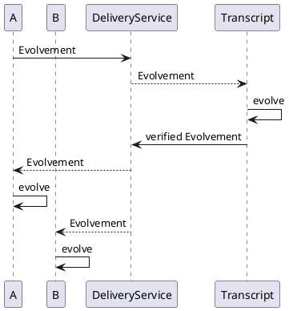

# Evolving Identity Concepts

An _Evolving Idendity_ (EID) is a group of _Clients_ that represent a single identity.
For instance, the devices of a user of an instant messaging service.
Further, an EID allows non-members to verify a membership of a Client.

The EID implementation fundamentally consists of two functional parts.

1. Distributed state management with its core functionality of evolving by adding, updating, or removing members
2. Providing a third party with the functionality to validate membership of any possible member.

For that we introduce the three main components of an EID implementation: _Client_, _Transcript_ and _Evolvement_.

<figcaption id="fig1" style="transform: scale(0.8)"><em>Figure 1. A sample scenario of an application using the EID.</em>
The EID has two members, device A and B. 
Device A wants to change the state of the EID, for example an update of its key material.
To do that, it creates an Evolvement and sends it to the Delivery Service (DS). 
The DS first sends the Evolvement to the Transcript which verifies and applies the Evolvement.
Since the Evolvement is valid A and B then also receive the Evolvement and apply it to their local states.
</figcaption>

## Client and Evolvements

Distributed state management implies that each member of the EID has to keep track of the EID's state individually.
For that, each member of an EID interacts with the EID through a Client.
A _Client_ allows a member to create changes to the EID, so-called _Evolvements_.
A valid _Evolvement_ represents a step from a state to its succeeding state.
For synchronization, an _Evolvement_ is sent from one _Client_ to another.
To allow dealing with conflicts, we separate the creation of an _Evolvement_ from its appliance.

A _Client_ can use `add()`, `update()`, `remove()` or `cross_sign()` functions to generate a succeeding _Evolvement_.
The _Client_ further provides the function `evolve()` to apply any _Evolvement_, ensuring its validity.
To add a member to the EID, in addition to the _Evolvement_ produced by `add()`, a cross-sign _Evolvement_, generated by
the _Client_ of the new member, is required.
Until the cross-sign _Evolvement_ is applied the member is not considered part of the EID.
This prevents new Clients from being added without their consent.
Moreover, a _Client_ can provide the list of EID members and thus validate cross-signed membership for any given member.

## Transcript

To allow a third party to validate any membership we introduce the _Transcript_.
A _Transcript_ can be instantiated by anyone, inside or outside the EID.
It is similar to a _Client_ in the sense that it allows tracking the state of the EID.
It also provides the functions to evolve and get current EID members, but is unable to create new _Evolvements_.
Additionally, it holds the first _trusted state_ of the EID and the log of all applied _Evolvements_.
This allows anyone knowing the _Transcript_ to verify memberships in any point in time of the EID history.

To initialize the creation of a _Transcript_, a _Client_ exports a subset of its current state, which can be sent to
another party.
This exported state is used to instantiate a _Transcript_, setting it to its initial trusted state.
