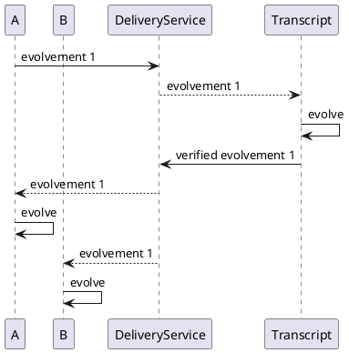

# Evolving Identity

```plantuml
@startuml
participant A order 1
participant B order 2
participant DeliveryService order 3
participant Transcript order 4

A -> DeliveryService : evolvement 1
DeliveryService --> Transcript: evolvement 1
Transcript -> Transcript: evolve
Transcript -> DeliveryService: verified evolvement 1
DeliveryService --> A: evolvement 1
A -> A : evolve
DeliveryService --> B: evolvement 1
B -> B: evolve

@enduml
```

## EID Member

## EID Evolvement

## Transcript

## Delivery Service